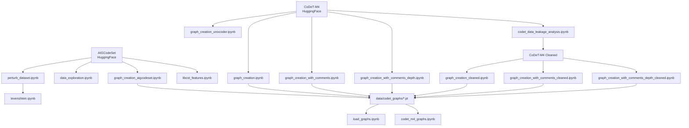

# From Syntax Trees to Embeddings: A Comparative Study of AI-Generated Code Detection

A comparative study of methods for detecting AI-generated code, evaluating three families of approaches: (i) traditional machine learning on engineered features extracted from concrete syntax trees (CSTs), (ii) embedding-based deep models built on pretrained CodeBERT representations, and (iii) graph neural networks operating on CST-derived graphs. Evaluated on the CoDeT-M4 dataset (500,552 samples across Java, Python, and C++) for binary classification of human-written vs. AI-generated code.

## Tech Stack

| Category | Tools |
|----------|-------|
| Deep Learning | PyTorch, PyTorch Geometric |
| NLP / Code Models | HuggingFace Transformers, CodeBERT |
| Graph Processing | Tree-sitter (Python, Java, C++) |
| Hyperparameter Optimization | Optuna |
| Experiment Tracking | TensorBoard, MLflow |
| Traditional ML | scikit-learn |
| Data Processing | pandas, NumPy, datasets (HuggingFace) |

## Installation

```bash
pip install -r requirements.txt
```

> **Note:** PyTorch is installed with CUDA 12.8 support (`torch==2.7.1+cu128`). 

## Project Structure

```
├── README.md
├── finetune_cbm_aigcodeset.py       # CBM fine-tuning with catastrophic forgetting detection
├── gcn res temp.txt                  # GCN experimental results
├── requirements.txt                  # Full dependency list
├── data/
│   ├── aigcodeset_perturbations_levenshtein.json
│   ├── codet_cleaned_20250812_201438/   # Deduplicated CoDeT-M4 splits
│   ├── codet_graphs/                    # Pre-computed CST-derived graph files (.pt)
│   └── codet_graphs_mmap/               # Memory-mapped graph variants
├── optuna/                              # Optuna study databases (.db)
└── src/
    ├── config/          # Argument parsers per model
    ├── data/
    │   ├── dataset/     # Dataset loaders (8 variants)
    │   └── *.ipynb      # Graph creation & data analysis notebooks (13)
    ├── experiments/     # Training/eval scripts (10) + analysis notebook
    ├── feature_extraction/  # CST feature extraction notebook
    ├── models/          # Model architectures (7)
    └── utils/           # Per-model training utilities (6)
```

## Datasets

### AIGCodeSet

- **Source:** [basakdemirok/AIGCodeSet](https://huggingface.co/datasets/basakdemirok/AIGCodeSet) on HuggingFace
- **Task:** Binary classification (human vs. AI-generated code)
- **Labels:** 0 = Human, 1 = AI
- **Splits:** Train/Val/Test with stratified splitting (80/10/10)

### CoDeT-M4

- **Source:** [DaniilOr/CoDET-M4](https://huggingface.co/datasets/DaniilOr/CoDET-M4) on HuggingFace
- **Task:** Binary classification of code authorship (human vs. AI)
- **Size:** 500,552 samples (246,221 human, 254,331 AI from 5 generator models)
- **Languages:** Java, Python, C++
- **Splits:** Train / Validation / Test (pre-split)
- **Fields:** code, target, model, language, source, features, cleaned_code

### CoDeT-M4 Cleaned

- **Source:** Locally deduplicated version of CoDeT-M4 (stored in `data/codet_cleaned_20250812_201438/`)
- **Purpose:** Addresses train/val/test data leakage (1,234 leaked samples found in original dataset)
- **Strategy:** Prioritizes preserving training data; removes duplicates from val/test

### Graph Datasets

Pre-computed CST-derived graphs stored in `data/codet_graphs/` as PyTorch files (`.pt`). Multiple variants exist:

| Variant | Suffix | Description |
|---------|--------|-------------|
| Base | _(none)_ | Standard CST node types |
| Comments | `_comments` | Comment nodes retained; textual content excluded |
| Cleaned | `_cleaned` | Duplicates removed from validation and test subsets |
| Comments + Cleaned | `_cleaned_comments` | Comment nodes retained and duplicates removed |
| Cleaned + Comments + Depth & Positional Emb. | `_cleaned_comments_depth` | Comment nodes retained, duplicates removed, nodes augmented with tree depth and child index |

Each variant includes `{split}_graphs_{suffix}.pt` and `type_to_ind_{suffix}.pt` (node type → index mapping).

## Data Processing Pipeline



### Notebook Descriptions

| Notebook | Purpose |
|----------|---------|
| [graph_creation.ipynb](src/data/graph_creation.ipynb) | Creates CST-derived graphs from CoDeT-M4 using Tree-sitter |
| [graph_creation_aigcodeset.ipynb](src/data/graph_creation_aigcodeset.ipynb) | Creates CST-derived graphs for AIGCodeSet |
| [graph_creation_cleaned.ipynb](src/data/graph_creation_cleaned.ipynb) | CST-derived graphs from deduplicated CoDeT-M4 |
| [graph_creation_with_comments.ipynb](src/data/graph_creation_with_comments.ipynb) | CST-derived graphs preserving comment nodes |
| [graph_creation_with_comments_cleaned.ipynb](src/data/graph_creation_with_comments_cleaned.ipynb) | Comment-inclusive graphs from cleaned data |
| [graph_creation_with_comments_depth.ipynb](src/data/graph_creation_with_comments_depth.ipynb) | Graphs with comments + tree depth and child index |
| [graph_creation_with_comments_depth_cleaned.ipynb](src/data/graph_creation_with_comments_depth_cleaned.ipynb) | All enhancements combined on cleaned data |
| [graph_creation_unixcoder.ipynb](src/data/graph_creation_unixcoder.ipynb) | UniXCoder-based code embeddings for graph nodes (exploratory) |
| [codet_data_leakage_analysis.ipynb](src/data/codet_data_leakage_analysis.ipynb) | Detects and resolves train/val/test data leakage (1,234 samples) |
| [data_exploration.ipynb](src/data/data_exploration.ipynb) | EDA on AIGCodeSet / CoDeT-M4 (code length distributions, outliers) |
| [codet_m4_graphs.ipynb](src/data/codet_m4_graphs.ipynb) | Exploratory analysis of generated graph data |
| [load_graphs.ipynb](src/data/load_graphs.ipynb) | Demonstrates loading pre-computed graphs from HDF5/PT |
| [perturb_dataset.ipynb](src/data/perturb_dataset.ipynb) | Generates code perturbations using Gemma 2B model |
| [levenshtein.ipynb](src/experiments/levenshtein.ipynb) | Levenshtein distance analysis for code classification (RAIDAR-inspired) |
| [libcst_features.ipynb](src/feature_extraction/libcst_features.ipynb) | Extracts structural CST features from code via Tree-sitter |

## Models

### Embedding-Based Models

| Model | Class | Architecture | Base Encoder |
|-------|-------|-------------|--------------|
| **Baseline** | `SimpleLinearHeadClassifier` | CodeBERT + linear classification head (1 or 2 layers) | CodeBERT |
| **Multi-Scale CNN + Bi-LSTM** | `CBMClassifier` | 4-kernel Multi-Scale CNN + Bi-LSTM with attention fusion | CodeBERT |
| **Multi-Scale CNN** | `CNNClassifier` | 4-kernel two-stage CNN (ablation without Bi-LSTM) | CodeBERT |
| **Multimodal** | `SimpleMultimodalClassifier` | CodeBERT + dim reduction + CST feature fusion | CodeBERT |

- **Baseline** ([baseline_model.py](src/models/baseline_model.py)): Extracts [CLS] token from frozen CodeBERT, passes through dropout + linear classification head. Evaluated with both 1-layer and 2-layer classifier variants.

- **Multi-Scale CNN + Bi-LSTM** ([cbmclassifier.py](src/models/cbmclassifier.py)): Adapted from [DOI: 10.1080/09540091.2022.2098926](https://doi.org/10.1080/09540091.2022.2098926), replacing GloVe with CodeBERT embeddings. Four parallel Conv1d layers (kernels 2–5) capture local n-gram-like features, while the Bi-LSTM captures long-range dependencies. Outputs are fused via attention-weighted concatenation.

- **Multi-Scale CNN** ([cnnclassifier.py](src/models/cnnclassifier.py)): Ablation variant — same multi-kernel CNN architecture without the Bi-LSTM branch, to isolate the contribution of sequential modeling.

- **Multimodal** ([multimodal_classifier.py](src/models/multimodal_classifier.py)): Combines CodeBERT [CLS] embeddings with 8 CST structural features (functions, classes, if statements, loops, imports, comments, binary operations, errors) via concatenation. Optional bottleneck dimensionality reduction.

### Graph-Based Models

| Model | Class | Architecture | Layers |
|-------|-------|-------------|--------|
| **GCN** | `GCN` | GCNConv or SAGEConv + global mean pooling | 2 |
| **GAT** | `GAT` | Multi-head GATConv + global mean pooling | 2 |
| **Graph Transformer** | `GraphTransformer` | TransformerConv with residual connections + layer norm | Configurable |

- **GCN / GraphSAGE** ([GCN.py](src/models/GCN.py)): Two-layer graph convolutional network with learnable node embedding. Supports both GCN convolution (`GCNConv`) and GraphSAGE aggregation (`SAGEConv`). Global mean pooling followed by a classifier head.

- **GAT** ([GAT.py](src/models/GAT.py)): Two-layer graph attention network. First layer uses multi-head attention (4 heads, concatenated); second layer averages single-head attention output. ELU activation.

- **Graph Transformer** ([GraphTransformer.py](src/models/GraphTransformer.py)): Stacked TransformerConv layers with residual connections and layer normalization. Configurable pooling (mean/max/add) and number of attention heads/layers. Two-layer MLP classifier.

### Traditional ML

Trained on 8 CST features (functions, classes, if statements, loops, imports, comments, binary operations, errors) extracted from code via Tree-sitter, normalized with StandardScaler. See [random_forest.py](src/experiments/random_forest.py).

- **Random Forest** — GridSearchCV-tuned (n_estimators=30, max_depth=20, min_samples_split=5)
- **CatBoost** — Grid-tuned (iterations=200, learning_rate=0.1, depth=4, l2_leaf_reg=3)
- **Logistic Regression** — Grid-tuned (C=0.01, penalty=l2, solver=liblinear)
- **Naive Bayes (Gaussian)** — var_smoothing=1e-9

## Experiments

All graph and CNN/CBM experiments support four modes:

| Mode | Flag | Description |
|------|------|-------------|
| **Train** | `--train` | Train model from scratch |
| **Resume** | `--resume` | Continue training from checkpoint |
| **Optimize** | `--optimize` | Optuna hyperparameter search |
| **Eval** | `--eval` | Evaluate saved model on test set |

### Running Experiments

**Baseline (CodeBERT):**
```bash
python src/experiments/baseline.py --epochs 10 --batch-size 32 --learning-rate 0.001
python src/experiments/baseline.py --eval
```

**Multi-Scale CNN + Bi-LSTM:**
```bash
python src/experiments/cbm.py --train --epochs 40 --batch-size 16
python src/experiments/cbm.py --optimize --n-trials 50 --search-epochs 15
python src/experiments/cbm.py --train --use-best-params --epochs 40
python src/experiments/cbm.py --eval
```

**GCN:**
```bash
python src/experiments/gcn.py --train --epochs 50 --batch-size 128 --data-suffix cleaned_comments_depth
python src/experiments/gcn.py --optimize --n-trials 50 --data-suffix cleaned_comments_depth
python src/experiments/gcn.py --train --use-best-params --data-suffix cleaned_comments_depth
python src/experiments/gcn.py --eval
```

**GAT:**
```bash
python src/experiments/gat.py --train --epochs 50 --data-suffix cleaned_comments_depth
python src/experiments/gat.py --optimize --n-trials 50
```

**Graph Transformer:**
```bash
python src/experiments/graph_transformer.py --train --num-heads 8 --num-layers 2 --hidden-dim 128
python src/experiments/graph_transformer.py --optimize --n-trials 50
```

**Fine-tuning (Transfer Learning):**
```bash
python finetune_cbm_aigcodeset.py
```
Fine-tunes a Multi-Scale CNN + Bi-LSTM model pretrained on CoDeT-M4 onto AIGCodeSet with catastrophic forgetting detection. Monitors CoDeT-M4 validation accuracy and alerts if it drops >5%.

### Experiment Scripts

| Script | Model | Dataset | Optimizer |
|--------|-------|---------|-----------|
| [baseline.py](src/experiments/baseline.py) | CodeBERT linear head | AIGCodeSet | StepLR |
| [baseline_codet.py](src/experiments/baseline_codet.py) | CodeBERT linear head | CoDeT-M4 | StepLR |
| [cbm.py](src/experiments/cbm.py) | Multi-Scale CNN + Bi-LSTM | CoDeT-M4 | CosineAnnealingLR / StepLR + Optuna |
| [cbm_new.py](src/experiments/cbm_new.py) | Multi-Scale CNN + Bi-LSTM (extended) | CoDeT-M4 | Optuna with wider search space |
| [cnn.py](src/experiments/cnn.py) | Multi-Scale CNN | CoDeT-M4 | Optuna |
| [embeddings_cst.py](src/experiments/embeddings_cst.py) | Multimodal (CodeBERT + CST) | AIGCodeSet | StepLR |
| [gat.py](src/experiments/gat.py) | Graph Attention Network | Graph CoDeT-M4 | ReduceLROnPlateau + Optuna |
| [gcn.py](src/experiments/gcn.py) | GCN / GraphSAGE | Graph CoDeT-M4 | ReduceLROnPlateau + Optuna |
| [graph_transformer.py](src/experiments/graph_transformer.py) | Graph Transformer | Graph CoDeT-M4 | ReduceLROnPlateau + Optuna |
| [random_forest.py](src/experiments/random_forest.py) | Random Forest | CoDeT-M4 + CST features | GridSearchCV |

## Configuration

Each model family has a dedicated argument parser in `src/config/`:

| Config File | Model(s) | Key Parameters |
|-------------|----------|----------------|
| [cbm_config.py](src/config/cbm_config.py) | Multi-Scale CNN + Bi-LSTM | lstm_hidden_dim, filter_sizes, gradient_clip |
| [cnn_config.py](src/config/cnn_config.py) | Multi-Scale CNN | filter_sizes, dropout_rate |
| [gat_config.py](src/config/gat_config.py) | GAT | heads, hidden_dims, data_suffix, dataset |
| [gcn_config.py](src/config/gcn_config.py) | GCN / GraphSAGE | hidden_dims, sage mode, source_model_name |
| [graph_transformer_config.py](src/config/graph_transformer_config.py) | Graph Transformer | num_heads, num_layers, pooling_method |

Common parameters across configs: `--epochs`, `--batch-size`, `--learning-rate`, `--seed`, `--device`, `--log-dir`, `--disable-tensorboard`.

## Dataset Loaders

Custom dataset classes in `src/data/dataset/`:

| Loader | Class | Format | Description |
|--------|-------|--------|-------------|
| [aigcodeset.py](src/data/dataset/aigcodeset.py) | `AIGCodeSet` | HuggingFace | Base AIGCodeSet loader with stratified splits |
| [aigcodeset_cst.py](src/data/dataset/aigcodeset_cst.py) | `AIGCodeSet_WithCSTFeatures` | InMemoryDataset | AIGCodeSet + 8 CST features via Tree-sitter |
| [aigcodeset_levenshtein.py](src/data/dataset/aigcodeset_levenshtein.py) | `AIGCodeSet_Levenshtein` | HuggingFace | AIGCodeSet with Gemma-based perturbations + Levenshtein distances |
| [codet_m4.py](src/data/dataset/codet_m4.py) | `CoDeTM4` | HuggingFace | Base CoDeT-M4 loader with flexible splitting |
| [codet_m4_cleaned.py](src/data/dataset/codet_m4_cleaned.py) | `CoDeTM4Cleaned` | Disk | Deduplicated CoDeT-M4 from local directory |
| [codet_m4_cst.py](src/data/dataset/codet_m4_cst.py) | `CoDeTM4_WithCSTFeatures` | HuggingFace | CoDeT-M4 + 8 CST features with parallel extraction |
| [graph_aigcodeset.py](src/data/dataset/graph_aigcodeset.py) | `GraphAIGCodeSet` | PyG InMemoryDataset | Pre-computed AIGCodeSet CST-derived graphs |
| [graph_codet.py](src/data/dataset/graph_codet.py) | `GraphCoDeTM4` | PyG InMemoryDataset | Pre-computed CoDeT-M4 CST-derived graphs |

## Utilities

Per-model utility modules in `src/utils/`:

| Module | Supports | Key Functions |
|--------|----------|---------------|
| [cbm_utils.py](src/utils/cbm_utils.py) | Multi-Scale CNN + Bi-LSTM | `train_model()`, `evaluate_model()`, checkpoint save/load, Optuna integration |
| [cnn_utils.py](src/utils/cnn_utils.py) | Multi-Scale CNN | `train_model()`, `evaluate_model()`, checkpoint save/load, Optuna integration |
| [gat_utils.py](src/utils/gat_utils.py) | GAT | `save_model()`, `load_model()`, architecture verification |
| [gcn_utils.py](src/utils/gcn_utils.py) | GCN / GraphSAGE | `save_model()`, `load_model()`, cross-model param transfer |
| [graph_transformer_utils.py](src/utils/graph_transformer_utils.py) | Graph Transformer | `save_model()`, `load_model()`, pooling/edge config |
| [utils.py](src/utils/utils.py) | General | `tokenize_fn()` for RoBERTa tokenization |

Common patterns across utils: `set_seed()`, `get_device()`, `get_metrics()`, `create_model_from_checkpoint()`, `create_model_with_optuna_params()`.

## Results

All results are on the held-out test split of CoDeT-M4 (cleaned). AI-generated code is the positive class.

### Traditional ML

| Model | Accuracy | Recall | F1 | Precision | Specificity | AUROC |
|-------|----------|--------|----|-----------|-------------|-------|
| **Random Forest** | **0.7374** | **0.6930** | **0.7210** | 0.7513 | 0.7800 | **0.8242** |
| CatBoost | 0.7363 | 0.6597 | 0.7101 | **0.7688** | **0.8097** | 0.8223 |
| Logistic Regression | 0.6329 | 0.6422 | 0.6314 | 0.6209 | 0.6240 | 0.6819 |
| Naive Bayes | 0.6083 | 0.5151 | 0.5628 | 0.6203 | 0.6976 | 0.6561 |

### Embedding-Based Methods

| Model | Accuracy | Recall | F1 | Precision | Specificity | AUROC |
|-------|----------|--------|----|-----------|-------------|-------|
| Baseline (1-layer) | 0.8452 | 0.8393 | 0.8404 | 0.8414 | 0.8507 | 0.9193 |
| Baseline (2-layer) | 0.9436 | 0.9289 | 0.9416 | 0.9547 | 0.9577 | 0.9847 |
| Multi-Scale CNN | 0.9734 | 0.9735 | 0.9734 | 0.9733 | 0.9735 | 0.9735 |
| **Multi-Scale CNN + Bi-LSTM** | **0.9836** | **0.9837** | **0.9836** | **0.9835** | **0.9837** | **0.9837** |

### Graph-Based Methods

| Model | Data / Config | Accuracy | Recall | F1 | Precision | Specificity | AUROC |
|-------|---------------|----------|--------|----|-----------|-------------|-------|
| GCN | Cleaned / Mean Pool | 0.8841 | 0.8620 | 0.8801 | 0.8971 | 0.9052 | 0.9509 |
| **GCN** | **Cleaned+Cmts / Mean Pool** | **0.9453** | **0.9280** | **0.9432** | **0.9589** | **0.9619** | **0.9849** |
| GCN | Cleaned+Cmts / Max Pool | 0.9300 | 0.9096 | 0.9272 | 0.9454 | 0.9497 | 0.9797 |
| GCN | Cleaned+Cmts / Attn Pool | 0.9377 | 0.9138 | 0.9349 | 0.9571 | 0.9607 | 0.9821 |
| GAT | Cleaned+Cmts / Mean Pool | 0.8794 | 0.8379 | 0.8718 | 0.9086 | 0.9192 | 0.9501 |
| GT | Cleaned / No PE | 0.9201 | 0.9034 | 0.9165 | 0.9301 | 0.9359 | 0.9744 |
| GT | Cleaned+Cmts / No PE | 0.9348 | 0.9122 | 0.9319 | 0.9525 | 0.9564 | 0.9807 |
| GT | Cleaned+Cmts + PE | 0.9351 | 0.9156 | 0.9325 | 0.9499 | 0.9537 | 0.9812 |

*GT = Graph Transformer, Cmts = Comment Nodes, PE = Positional Embeddings (tree depth + child index)*

Embedding-based methods achieve the highest performance (Multi-Scale CNN + Bi-LSTM at **98.4% accuracy**). Graph-based methods are competitive, with the best GCN configuration reaching **94.5% accuracy**. Adding comment-indicator nodes (without their textual content) consistently improves graph model performance, suggesting that comment placement carries stylistic signal relevant to authorship detection.
